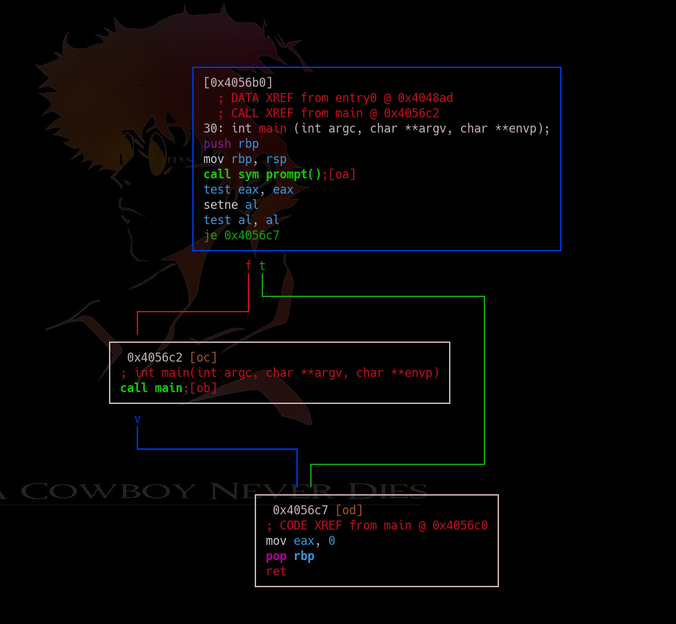
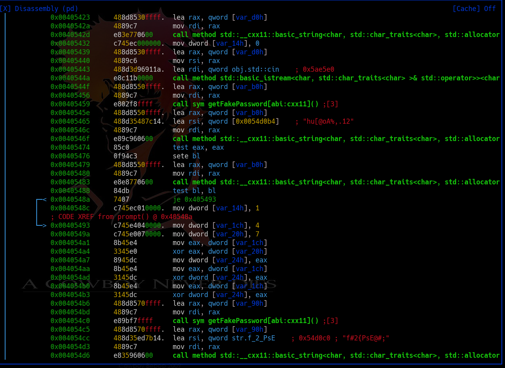
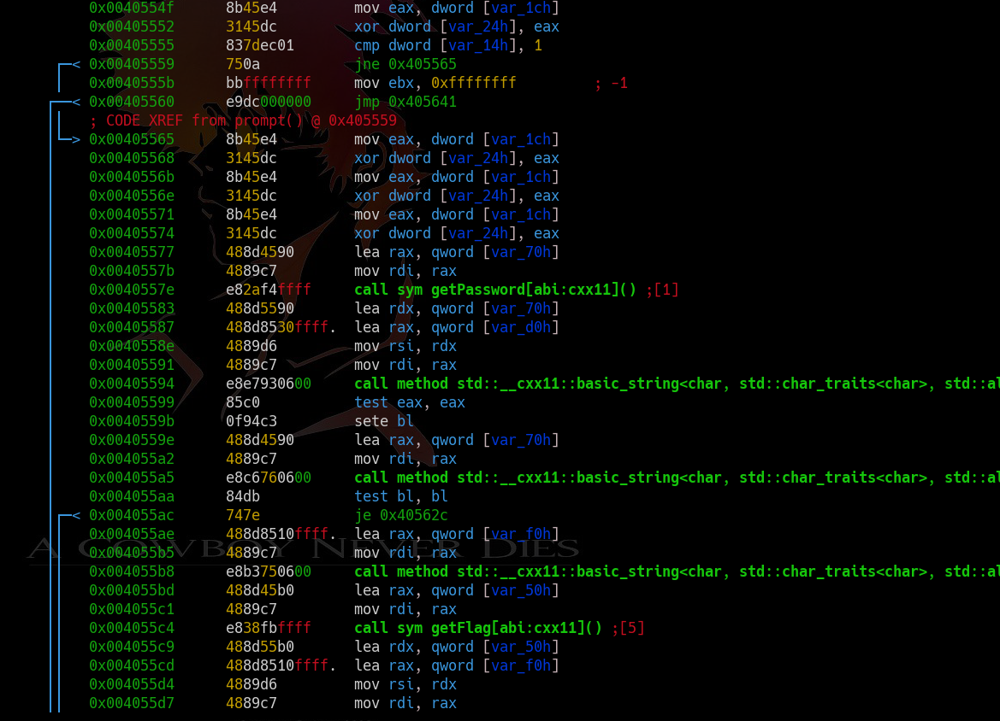
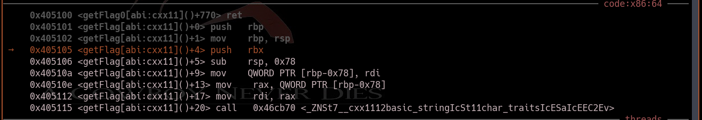
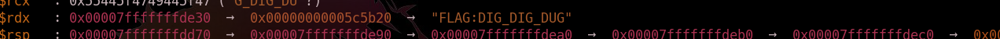

TF: Tech for Troops 2020
Challenge: BingoSplit

Category:  RE

Points: 350

Difficulty: Intermediate

## Instructions

***Description:****

See if you can find the flag.

***Hints:***

None

## Solution

So if we go in and analyze the program like we did with bingobox, we see that
it is very similar to that program from bingobox. However, we cannot see the
flag statically. This means that we will most likely need dynamic analysis to
find the flag.

We can see in prompt that it calls a getFlag and getPassword function, as well
as a getFakePassword function.

So I decided to go into gdb and set a break point at prompt and getFlag. What we
can do is step through the function and eventually we see that the actual password
is stored in a register: v/tA8>8)Dw,+tgu. The next time it comes around that we
input the flag into gdb we insert this flag and cycle through one more time, now
it will enter into the getFlag function:

Now that we have entered the getFlag function eventually we get to the end and
the value is stored in the rax register.

## Flag

`DIG_DIG_DUG`

## Mitigation

The problem here is that there is no way to hide the password and flag when
doing dynamic analysis. So as long as you break at the correct points and can
accurately trace the values of the registers you can figure out the password
and thus the flag. The best way to mitigate this is remove the program from
the user, so running it on a netcat server or so that the user cannot
reverse the source code.
