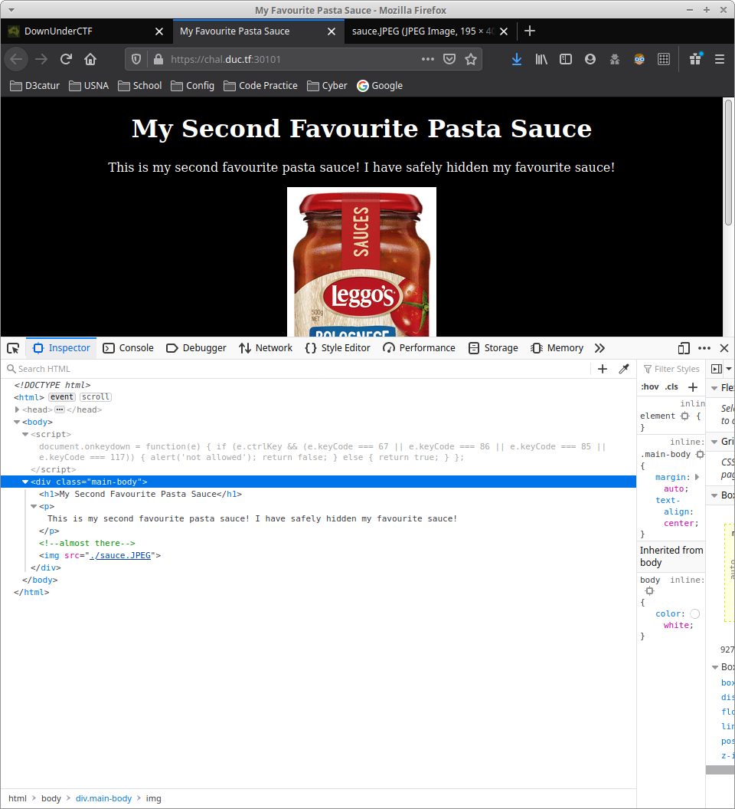
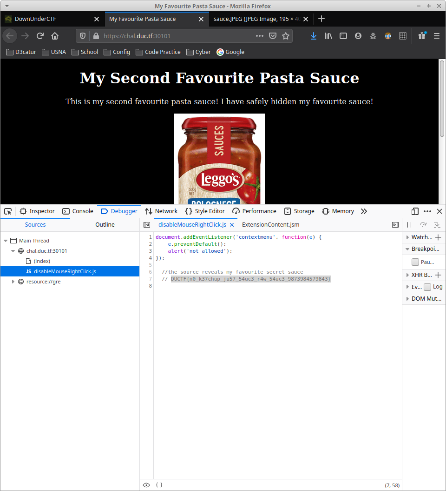

TF: Down Under CTF 2020
Challenge: leggos

Category: web

Points: 100

Difficulty: Introductory

## Instructions

***Description:***

I <3 Pasta! I won't tell you what my special secret sauce is though!

[http://play.duc.tf:10001](http://play.duc.tf:10001)

**Hints:***

None

## Solution

If we go to the webiste we are presented with this page:

Its simple enough if we just go inside of the developers console than we get
to see the flag easily within a script that disables right clicking. However,
the challenge is getting to the console the way we do that without right clicking
since we cannot we use the F12 key.

## Flag

`DUCTF{n0_k37chup_ju57_54uc3_r4w_54uc3_9873984579843}`
## Mitigation

The problem here is that the script only stops us from right clicking. It should
just disable the deveolpers console or also the F12 key.
