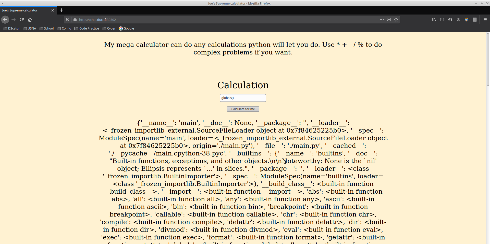

TF: Down Under CTF 2020
Challenge: Addition

Category:  misc

Points: 200

Difficulty: Intermediate

## Instructions

***Description:***

Joe is aiming to become the next supreme coder by trying to make his code smaller
and smaller. His most recent project is a simple calculator which he reckons is
super secure because of the "filters" he has in place. However, he thinks that
he knows more than everyone around him. Put Joe in his place and grab the flag.

***Hints:***

None

## Solution

So whe you go the webiste you get this:

It seems pretty simple in terms of functionality the webpage just does some
basic addition, which is seems it does so using python. Having done some python
web injection before I decided to just run an os system command to cat a file,
but this is what I got:

After which I realized that it was using filters to most likely filter out
anything using the system command or any additonal commands. However, the
one thing that never seems to be fitlered in these challenges is the globals()
function. So if we pass this inside the function instead then we get the flag.

## Flag

`DUCTF{3v4L_1s_D4ng3r0u5}`

## Mitigation

The way that this can be mitigated is not having the flag be a constant within
the globals or by filtering out the global variable.
