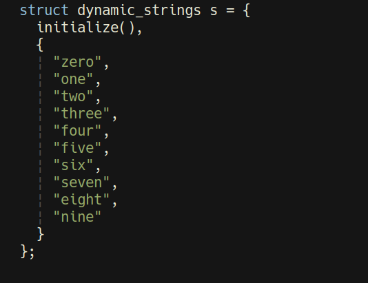
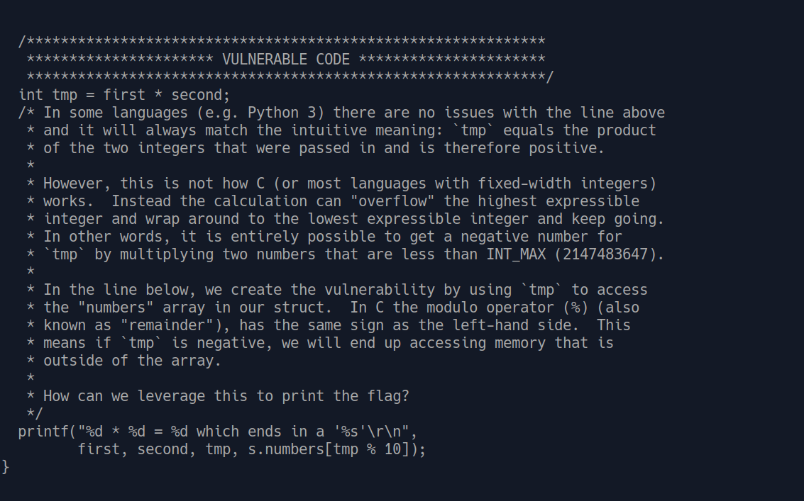
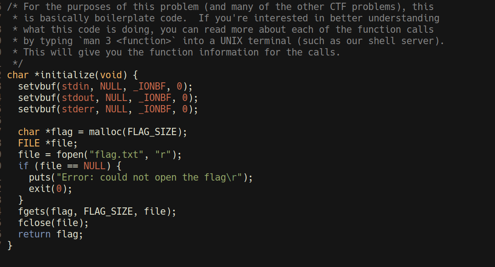
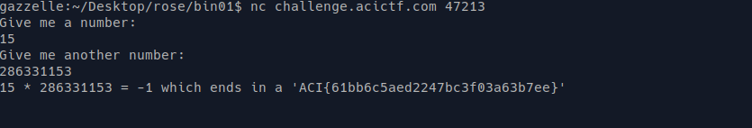

TF: Cyberstakes 2020
Challenge: Binary Exploitation 101

Category:  Binary Exploitation

Points: 40

Difficulty: Introductory

## Instructions

***Description:***

Exploiting bugs in programs can definitely be difficult. Not only do you need
a certain amount of reverse engineering required to identify vulnerabilities,
but you also need to weaponize that vulnerability somehow. To get new hackers
started, we included our annotated [source code](BE1010.c) along with the compiled
[program](BE101). If you don't know where to start, download the source code and
open it in a program with syntax highlighting such as notepad++ or gedit. If
you don't have the ability to use either of those, you can always use vim.

You can connect to the problem at `telnet challenge.acictf.com 47213` or
`nc challenge.acictf.com 47213`

***Hints:***

## Solution

Since they graciously provided us the source code I first decided to take a
look at that. Inside we see that the file is heavily commented and provides
multiple hints on how to solve the challenge. Essentially though we have 
three main parts. A struct:

A main:

And a flag function:

What we can see is that program creates a struct in that struct it contains
a string of the flag and an array of strings that are the written version
of numbers. Next the main asks for two numbers if either number is negative
it will exit. It then does a mod 10 on it to find the number that it ends
in and will print the string represenation of that number. So we need to
figure out how to exploit this. Well since it is printing out a string,
we may be able to get the printf to print the flag string instead. The real
exploit exits in the fact that we know that the flag is right behind the array
64 chars in fact behind it since the buffer size is 64. So what we wnat is
to get -1 to be put in the array when it prints instead. The way that we do
this is take advantage of the fact that the ints are signed meaning that they
have a max represenation of 2,147,483,647, if we an int larger than that it
will actually result in a negative number number. So when all of the bits are
ones that including the leading bit that is in fact -1.
The binary version in 2s complement of the largest signed int is:
01111111111111111111111111111111 so by flipping that leading 1 we get the number
-1 in signed ints and 4294967295 in unsigned. So we just put in 15 times
286331153 which are factors of the number and we should get our flag.

## Flag

`ACI{61bb6c5aed2247bc3f03a63b7ee}`

## Mitigation

The security issue here is that a user can now access values on the stack
by manipulating how negative that value is. Which allows them to do things
like accessing the flag variable. The way to mitigate this would be to
convert the ints into unsigned ints or to add a check to make sure that the
product is not negative.
