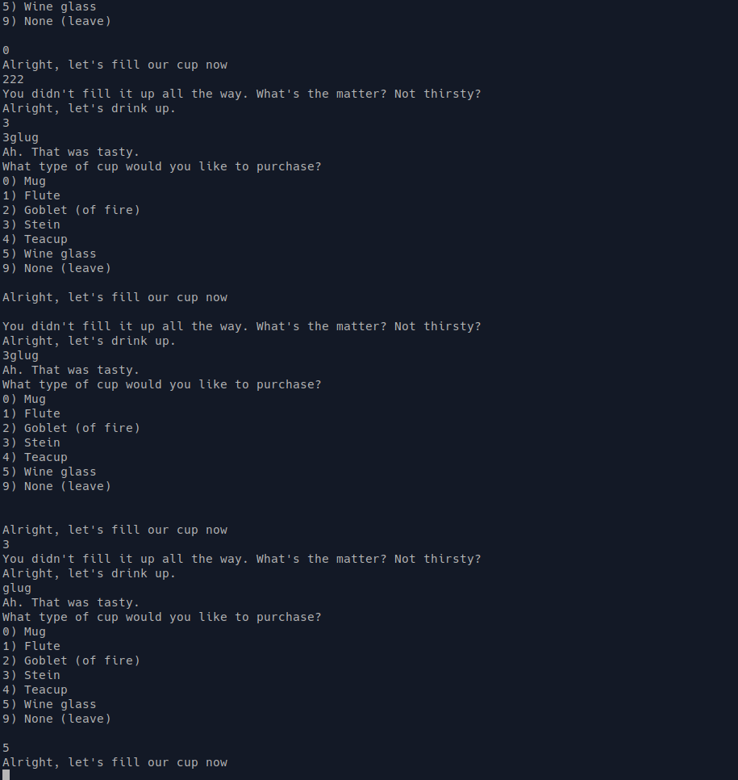
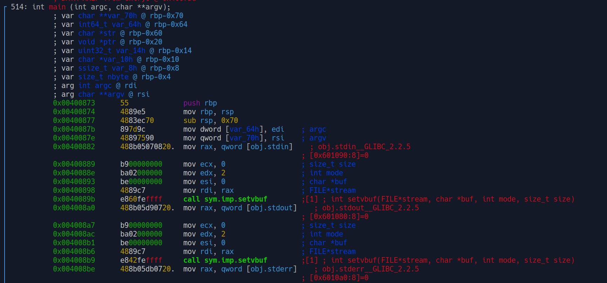
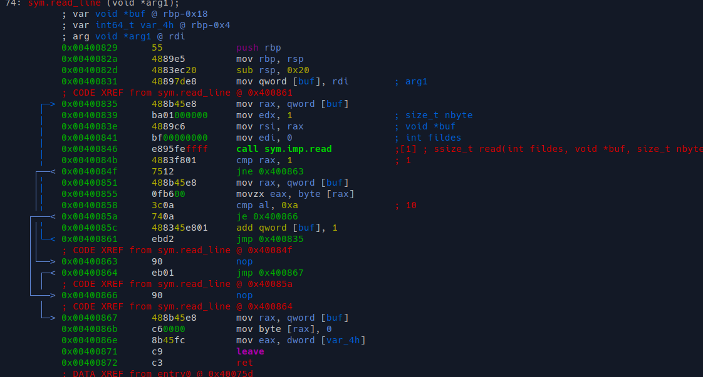
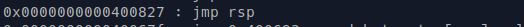
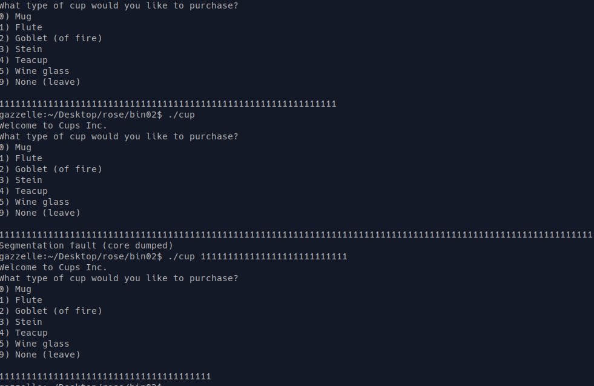
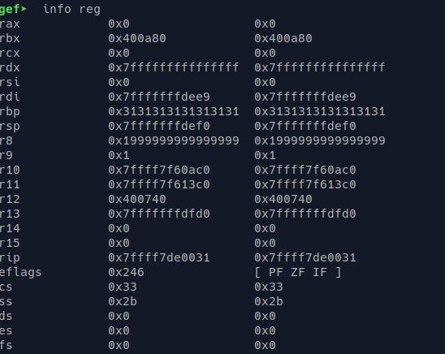

TF: Cyberstakes 2020
Challenge: Your Cup Overfloweth

Category:  Binary Exploitation

Points: 40

Difficulty: Introductory

## Instructions

***Description:***

Your cup overfloweth. Drink up. Challenge Binary: [cup](cup). Listening on
challenge.acictf.com:41921

***Hints:***

Your cup (the stack) is executable.

Your cup will bounce when it hits the floor in the right spot (gadget).

Try not to spill any crumbs (newlines) into your cup.

## Solution

Running the program we get a infinite loop:

Staic analysis showed what we already knew that the program goes through an
infinite loop no matter what choice you pick until you exit. If we analyze
in GDB we notice that the program has an alarm implemented that exits the
program when no input in put in for a long time.
Opening the program in r2 we see to get user input it calls a function
called read_line. This is most likely where we will have to exploit the
program as it is the only place we can influence it. We see that
it creates a buffer 0f 0x18 so 24. So we will have to overwrite it with at least
24 1s to get an overflow. So I tried doing aorund 24 1's, but I didn't
get anything back. i figured that this is because there are more things
that are put on the stack before this function is called so we will have
to guess how much it is.

So since the stack is executable we want to to be able to put in remote
code execution to try and pop a shell. We know we are looking for a
ROP Gadget that does a jmp to rsp that way we can fill the buffer
then overwrite the stack pointer then when we call that jmp it will
instead jmp to our code. If we run ROPgadget we can see that there is
a rop gadget at 0x400827 that jumps to rsp.

Next we need to try and see if we can overflow that buffer:

After testing it I found that 105 1s worked. Doing this in GDB we can
look at the registers and see that we overwrote the base pointer with 1s
hence the value being 0x31s in sequence.

So according the hints we need use the overflow to overwirte the base pointer
right above that is the RET address whcih we can put in the address for the
rop gadget we found earlier and then provide. We must also input shellcode to
help us run execve() with the argument /bin/sh which are the arguments above
the RET. what I found was 0x6A 0x42 0x58 0xFE 0xC4 0x48 0x99 0x52 0x48 0xBF
0x2F 0x62 0x69 0x6E 0x2F 0x2F 0x73 0x68 0x57 0x54 0x5E 0x49 0x89 0xD0 0x49
0x89 0xD2 0x0F 0x05 0x0A. After crafting the exploit we can send it to the
the server and then we will have remote code execution. Specifically if you
send it to a file cat that file and provide a hyphen then send it to the server
it will allow you to maintain access to the shell.

## Flag

I tried to connect to the cyberstakes netcat on both my hotspot and on the wifi
at saint johns, but it kept hangin when ever I had any kind of input. I know the
exploit works, but sadly I was having trouble with the cyberstakes server.

## Mitigation

The problem is that the stack is executable and that the program has a buffer
overflow, becuase of this we are able to overwrite values on the stack and then
of course execute code from the program that allows us to the open a shell. To
correct this we should make the stack non-executable and then also put in checks
in place like a canary to stop the buffer overflow.
