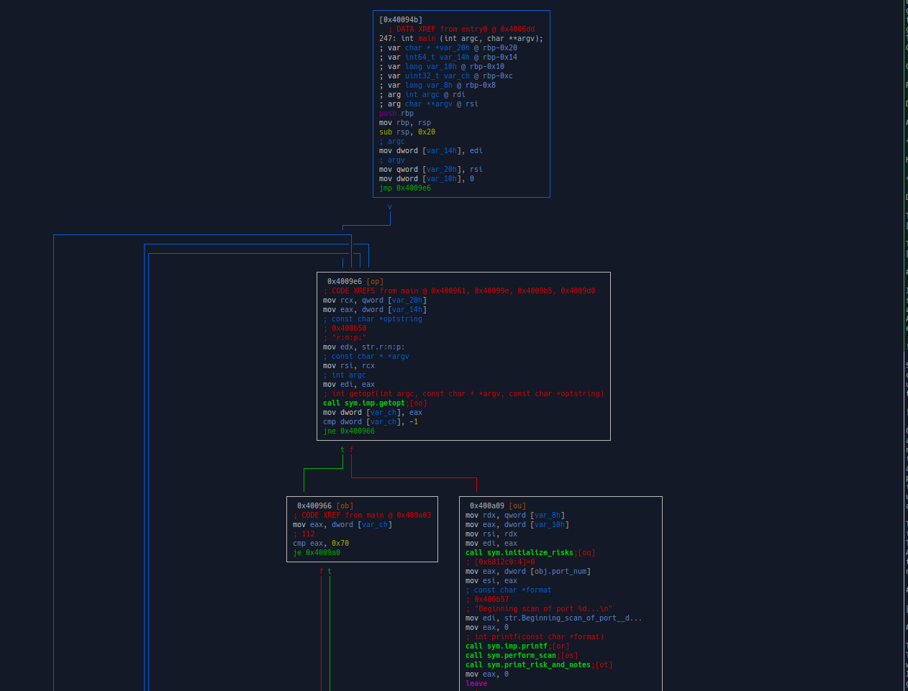
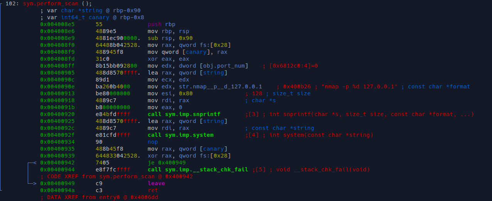

TF: Cyberstakes 2020
Challenge: Hacker, Scan Thyself

Category:  Binary Exploitation

Points: 20

Difficulty: Intermediate

## Instructions

***Description:***

Hey, check out this really advanced port scanner!

***Hints:***

Did you know you can use a negative index for arrays?

The GOT and PLT sections look pretty
[interesting](https://ctf101.org/binary-exploitation/what-is-the-got/).

There is a lot of fun to be had when you
[stomp](https://www.exploit-db.com/papers/13203) over the GOT

## Solution

If we run the program we see that it preforms a port scan, since it is the local
system it scans our system instead. If we open up the dissassembly of the we can
ascertain multiple things. Firstly we see that the program has multiple functions.
A function to do the actual scan, a function to print notes, a function to set
everything up, an a main.

Specifically we see in perform_scan that it makes a
call to system which runs any command given to it as an argument with options
using `sh -c`. So I believe that the idea is to get another function to point to
the system() call in perform_scan.

Coincidentally the program allows us to enter options specifically p,r, n. p
allows us to specifcy a port number and uses atoi to convert it into a port
number. I do not know what the r option does, but it converts its input
into an unsigned long. And the n option takes in notes that it will later print
after the scan is performed. That is the real advantage. We can overwrite a
previous puts to point to the system instead on the GOT, that way when this puts
is called with our string which will be `sh` we will have the scanner perform for
us sh -c sh which will give us a shell, where we can then look for the flag file
and open it up.

The rest of the problem boils down to us needing to leak the address of system()
in the GOT this is simply done by using GDB and breaking after the system call.
Then if we do x/x for the call to system we will see its position of the GOT.
After that we need to figure out how to use the options of -r -p to manipulate
the program to overwrite the puts address with that of system. I, however, could
not figure out how to do this. I still have a lot to learn.

## Flag

[ The flag here ]

## Mitigation

The users ability to manipulate the GOT address of the puts function is the problem.
This allows the user to manipulate the address to point to the system call, that combined
with a puts that takes user input enables the user to put anything into the system call.
In this case we use sh to get a shell running and do remote shell execution.
