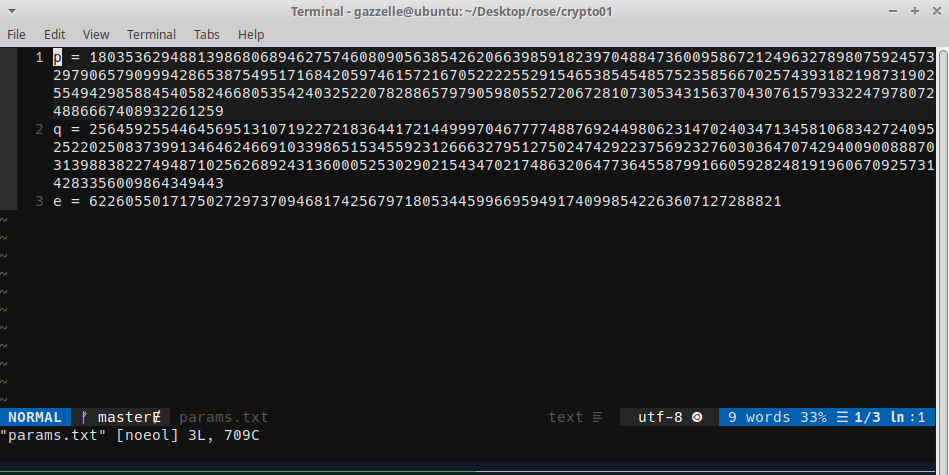

TF: Cyberstakes 2020
Challenge: Really Senseless Admins

Category:  crypto

Points: 20

Difficulty: Introductory

## Instructions

***Description***

We fired Julius, but the new guy apparently misplaced the file with our pivate
key. All he could find was the encrypted flag and some file labeled 'params'.
[flag.enc](flag.enc) [params.txt](params.txt)

***Hints***

The new guy apparently just treated the flag text as a
[big-endian](https://en.wikipedia.org/wiki/Endianness#Big-endian) integer.
Apparently, this made it easier for him to use the online tools he had found.

Wouldn't it be nice if there were detailed
[write-ups](http://en.wikipedia.org/wiki/RSA_(cryptosystem)) about these cryptosystems?

We found a few notes on the admin's desk. One note just had the URL of an online
[RSA tool](https://www.cryptool.org/en/cto-highlights/rsa-step-by-step).
The second note had
[two URLs](https://www.rapidtables.com/convert/number/ascii-hex-bin-dec-converter.html)
on it with 'plaintext ⇒ hex ⇒ int.
The third one makes it look like the plaintext generated
by the RSA tool will start with 104.

## Solution

We are given two files from the challnege a encrypted flag and a set of parameters
containing a p,q, and e. From these parameters I figured that it was an RSA
which was also inferred from the challenge title as the first letters of each
word makes RSA. The files look like this:

So what I did was I wrote a python script that reads from the file and decrypts
the flag. What the program does is computes the r value from p and q, and then
finds the decryption parameter d, from the inverse relationship e*d = 1 + tot(mod(n))

    #!/usr/bin/env python3
    from Cryptodome.Util.number import inverse
    p = 180353629488139868068946275746080905638542620663985918239704884736009586721249632789807592457329790657909994286538754951716842059746157216705222255291546538545485752358566702574393182198731902554942985884540582466805354240325220782886579790598055272067281073053431563704307615793322479780724886667408932261259
    q = 256459255446456951310719227218364417214499970467777488769244980623147024034713458106834272409525220250837399134646246691033986515345592312666327951275024742922375692327603036470742940090088870313988382274948710256268924313600052530290215434702174863206477364558799166059282481919606709257314283356009864349443
    e = 62260550171750272973709468174256797180534459966959491740998542263607127288821
    f = open("flag.enc", "r")
    flag = int(f.read())
    r = (p-1)*(q-1)
    d = inverse(e,r)
    m = pow(flag, d, (p*q))
    m = bytearray.fromhex((hex(m)[2:])).decode()
    print(m)

## Flag

`ACI{Pr1m3s_T!M3z_a2bf8d64}`

## Mitigation

What this problem  highlights is an information leak. Allowing the parameters of
the RSA encryption to be readily available creates a vulnerbility as it allows
anyone to easily decrypt the flag. It only takes about 8 lines to break the RSA
encryption using the paramters given. The best mitigation would be to make sure
that the parameters do not leak and people do not have access to that or the
private key.
