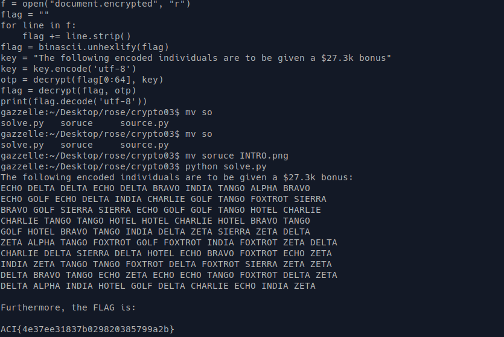

TF: Cyberstakes 2020
Challenge: Over Time: Paid

Category:  crypto

Points: 20

Difficulty: Introductory

## Instructions

***Description***

After many months of hard work by our agents, we've gained access to a sensitive
payroll document from a competitor. Unfortunately, it looks heavily encrypted.
[document.encrypted](document.encrypted) [source.py](source.py)

***Hints***

Isn't it strange how each line of text in their document is of an identical length?

Key Management is a difficult problem on the battlefield; maybe they reused key
material in this document?

Previous documents we've recovered had lines of encrypted whitespace as a result
of text-formatting in the plaintext... Maybe that applies to this document too?

## Solution

All suggestions and hints point us to the conclusion that this problem is a one
time pad encryption. Which means we will need to analyze exactly what the program
is doing in order to decrypt the message, but first we have to find the one time
pad. What we notice is that each line in the message is the same length 64 bytes
to be exact, which means that the key itself is 64 bytes long since each line is
created by xoring the data with the key. The way to find the key then is to xor
the data with the prevously known plaintext as that will produce the key. Not
surpirsingly the INTRO variable in the source file is exactly 64 bytes long, so
we can use this to decrypt the key. That will be the first part of the python
script, then with the one time pad we got we can run the xor again with the entire
file and that will give us back the decrypted file with the correct flag.
The python script looks like this:

    import binascii
    def decrypt(data, otp):
        out = []
        for i in range (0, len(data)):
            out.append(data[i] ^ otp[i % len(otp)])
        return bytes(out)

    f = open("document.encrypted", "r")
    flag = ""
    for line in f:
        flag += line.strip()
    flag = binascii.unhexlify(flag)
    key = "The following encoded individuals are to be given a $27.3k bonus"
    key = key.encode('utf-8')
    otp = decrypt(flag[0:64], key)
    flag = decrypt(flag, otp)
    print(flag.decode('utf-8'))

So in the script what we do is we rewrite the given encrypt_otp function
to instead use a defined otp, that way we can then determine what the true
otp is from xoring the key variable with the first line of the encrypted text
which should be the key variable encrypted. We then use the otp derived from
that to re xor the entire file to get back to the plain text and then print
out the text. We must make sure that when it is sent to the function it is
in a binary form to properly xor the data. This gives us the flag:

## Flag

`ACI{4e37ee31837b029820385799a2b}`

## Mitigation

The security issue here is two fold. Firstly there is data leak as I have
access to the original source code of the encryption. But secondly the
one time pad is easly crackable as it is only an xor, xors can always be
undone by another xor, or you can find the other piece of the puzzle
simply by using the other two, making it insecure, when so much information
is available. The best mitigation would be to use a stronger otp or encryption
scheme.
