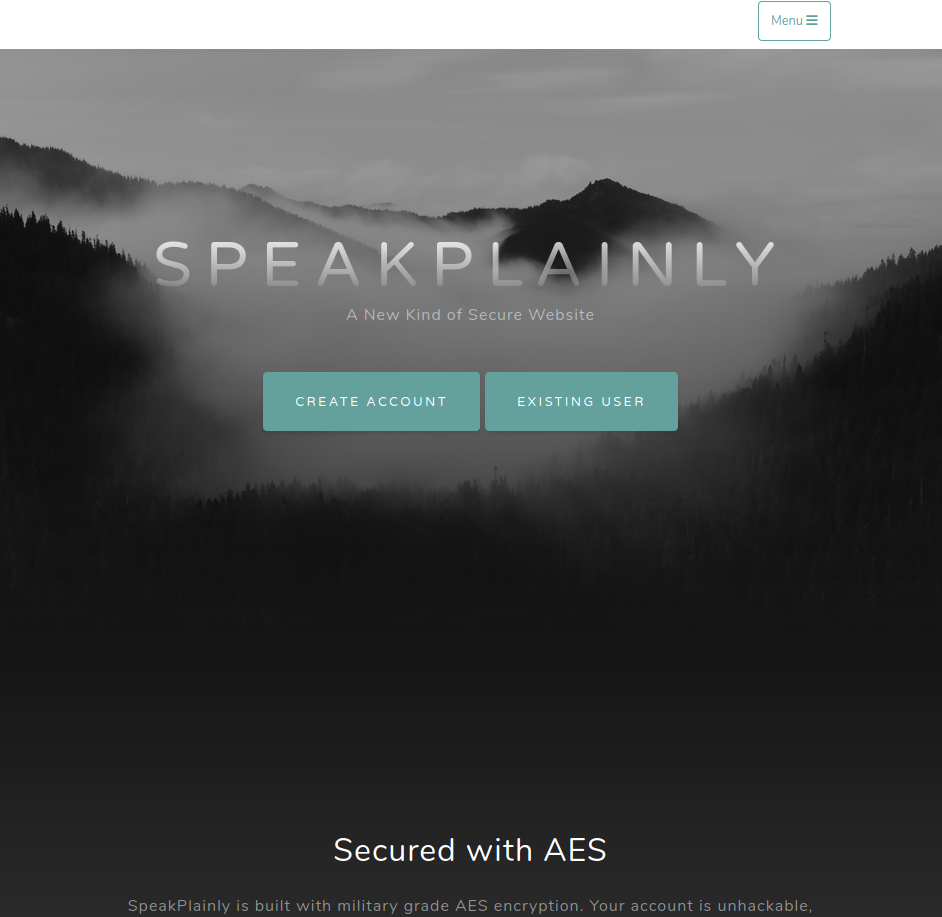
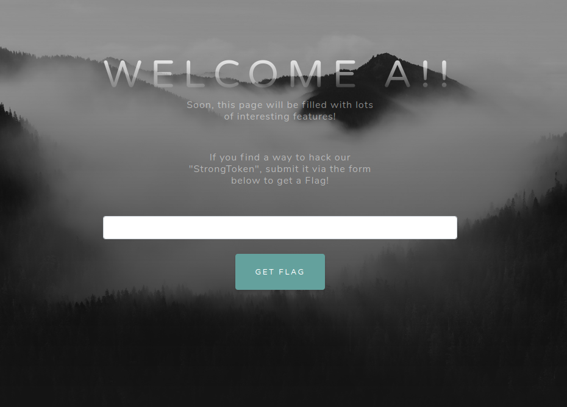

TF: Cyberstakes 2020
Challenge: Speak Plainly

Category:  crypto

Points: 20

Difficulty: Intermediate

## Instructions

***Descriptions***

There's something suspicious about how account logins happen on this
server... ? http://challenge.acictf.com:62963

***Hints***

Your username and the secret strongtoken are the only components of
the encrypted cookie

How does the length of your username effect the length of the cookie?

It is possible to guess strongtoken one byte-at-a-time because of
how AES-ECB works

The strongtoken itself does not contain any ';' characters

## Solution

When you go to the website you are presented with this:

From the hints you know that you are looking for change in the cookies, specifically
the auth_token cookie. After playing around with username lengths I found that a
username with 16 characters caused a change in the cookie. Which I could only infer
meant that the blocks for the ecb cipher are 16 bytes long.

So after that I turned my attention to the page after the create account that
asks for the strong token in order to get the flag. It looks like this:

Following the hint about guessing the strong token on byte at a time, I attempted
to write a python script to find the key. However, this is where I failed in my
ability to solve the challenge I do not know if I am missing a concept or I just
did not write the solution correctly. After running my script I got this:
b';>76\`Evu_#.i5@6F6'.

## Flag

[ The flag here ]

## Mitigation

The issue here is the use of aes-ecb. ecb allows the user to easily brute force
the given cipher text as long as they can control the size and find out the
block size. ECB itself will always yield the same block when encrpyting the same
text, thus its consitency is what makes it insecure.
The best way to mitigate this is to one not store the encryption in
cookies, but also to instead use aes-cbc becuase it way more secure.
