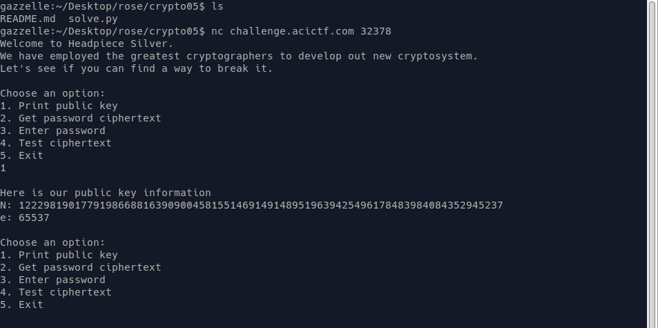
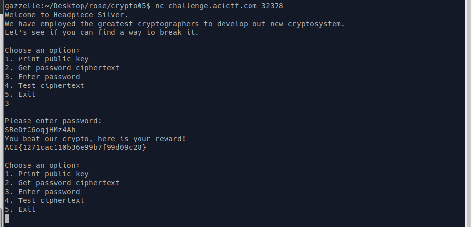

TF: Cyberstakes 2020
Challenge: Headpiece Silver

Category:  crypto

Points: 20

Difficulty: Intermediate

## Instructions

***Description***

Can you break our unbreakable crypto? challenge.acictf.com:32378

***Hints***

How large is the N that you receieved?
The password is alphanumeric
`telnet` is known to interact poorly with the challenge instance.
We recommend using 'netcat' to connect to the challenge.

## Solution

The problem gives you url to connect to so what I did was immediately netcatted
on to it: `nc challenge.acictf.com: 32378` You are then presented with some options,
which I explored:

Essentially it looks like we are suppposed to decrypt another RSA encryption based
off of the N, e, and ciphertext that we are given. The N looks easily factorable,
so I plugged it into factordb and got back to factors quickly. From here I crafted
a quick python script to decrypt the ciphertext to get the password. It looked like
this:

    from Cryptodome.Util.number import inverse
    p = 368413955753084554445712063216091990363
    q = 331958624987283540029528593686625501199
    n = 122298190177919866881639090045815514691491489519639425496178483984084352945237
    e = 65537
    c = 0xc6f12da543dd5f614fb8c0c9cf95babba7616b760a0557ee29bd47e7f909ba6b
    r = (p-1)*(q-1)
    d = inverse(e, r)
    m = pow(int(c), d, n)
    print(bytearray.fromhex(hex(m)[2:]).decode())

Which gave this as the output `SReDfC6oqjHMz4Ah`. I then plugged this into the
program using the enter password option and got out the flag:

## Flag

`ACI{1271cac110b36e99b7f99d09c28}`

## Mitigation

What the security issue here is that the N is not a large enough number.
For the N to be effective it should be much harder to factor or not have
any known factors, that way to is essentially impossible to decrypt the
ciphertext unless you have the right keys. Since the N was so small
it was easy to then find the factors and then receive d from the inverse
relationship with e.
