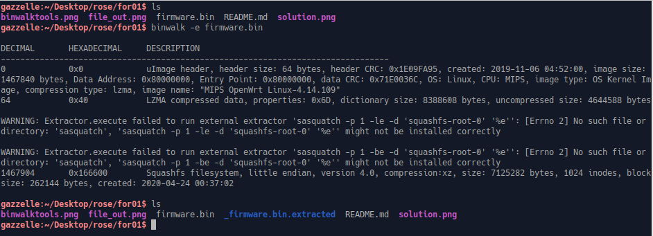

TF: Cyberstakes 2020
Challenge: Controlled Access

Category:  forensics

Points: 20

Difficulty: Introductory

## Instructions

***Description:***

We've been asked to help a certificate authority figure out what a
[device](https://shop.hak5.org/products/shark-jack) they found
plugged into their network was doing. They were able to dump the [firmware](firmware.bin)
and would like to know if it allowed the attacker to connect to any devices that
their firewall (which blocks inbound SSH) would have stopped. Their internal
domain uses 'digisigner.local' for DNS host names. The flag is the hostname of
the internal host that the hacker targeted (i.e. `ACI{[local hostname targeted]}`).

***Hints:***

A tool like [binwalk](https://github.com/ReFirmLabs/binwalk) might be useful for
inspecting the firmware.

The [documentation](https://docs.hak5.org/hc/en-us/categories/360002117973-Shark-Jack)
mentions that the 'attack' payload for this device lives in a very particular
spot on the filesystem...

## Solution

First I ran the file command on the bin file to ensure that it was intact,
that produced this output:

It showed that it was in fact intact and that it is a mips filesystem. I decided
to then explore what I could do with binwalk to try to extract or retrieve the
attack payload. Unfourtanetly the links in the hints were not working for me so
I instead made educated guesses about the location of the payload. Firstly,
looking at binwalks toolset we see that we can simply extract the filesystem
using the -e option:

So that is exactly what I did and I got back the filesystem to explore:

Based off of my limited knowledge of payloads I figured that the payload
would either be in the tmp directory to avoid detection or in the root folder
for sudo access. I first went to tmp but it was empty, so instead I went into
root which showed me a payload.sh file, in which the contents shows the
hostname giving us the flag:

## Flag

ACI{rootca.digisigner.local}

## Mitigation

The real security issue here is that there was no accountability on the systems
that were plugged into the computer. This allowed a SharkJack to be plugged in
and its program to download and run. We should always be checking what is plugged
in and what the purpose of that object is.
