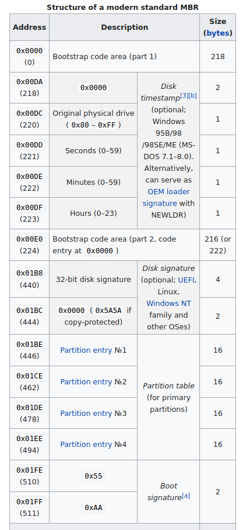
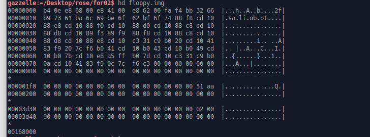
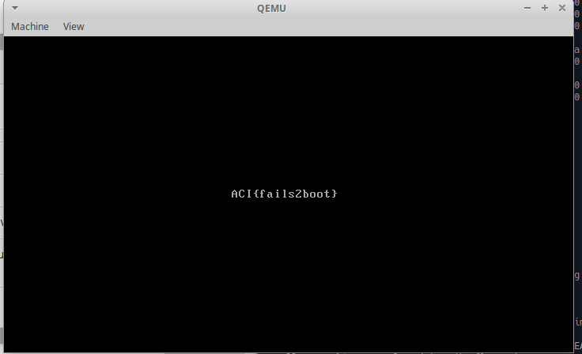

TF: Cyberstakes 2020
Challenge: Boot Master

Category:  forensics

Points: 20

Difficulty: Introductory

## Instructions

***Description:***

We found another floppy disk [image](files.tar.gz), but we can't get this one
to boot like we did the last one. The disk had been sitting
around for a while so we're wondering if some of the data was
corrupted. Any ideas?

***Hints:***

It looks like `file floppy.img` identifies this one as just "data"...

How does `file` recognize that an image contains a
[master boot record](https://en.wikipedia.org/wiki/Master_boot_record#cite_ref-NB_Timestamp_14-0)?

You'll probably need some kind of 'hex editor' for this problem.

Can we change one bit in the image and fix the problem?

## Solution

First I had to extract the file frome the tar they gave us, wich was a simple
`tar xvzf files.tar.gz` what that produced was the floppy.img file. If you run `file`
on the image it returns that it is simply just data. So to me it was then obvious
that the file was corrupted somehow. Luckily in the hints it points us to
[this](https://en.wikipedia.org/wiki/Master_boot_record#cite_ref-NB_Timestamp_14-0)
helpful wikipedia page, if we read far enough we can find a section that details
the offsets and values of the modern day MBR file, in that table we see that
the MBR file should have the signature 0x55 and 0xAA.

Going through the structure of a MBR file we see that the Boot Signature for a MBR
is 0x55AA, we see something very similar to this in the hexdump which is 0x51AA.

From the hints we know we only have to change one bit so I went and changed 0x51
to 0x55 using hexedit. After changing the one bit we can load the image using qemu
`qemu-system-i386 floppy.img` which gives us the solution.

## Flag

ACI{fails2boot}

## Mitigation

I would say the issue here is that we are not making sure theat the file isn't corrupted
the best way to mitigate this is to make sure that the image cannot be tampered with.
Or to make sure when downloading it or extracting the image nothing goes wrong.
