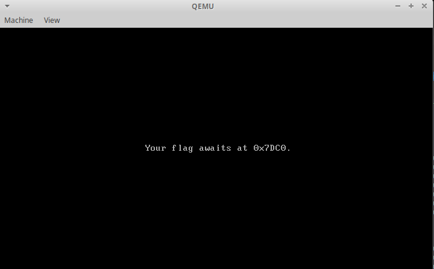
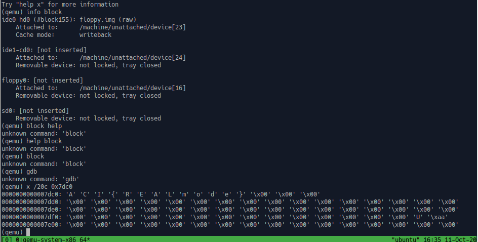

TF: Cyberstakes 2020
Challenge: Boot Riddle

Category:  forensics

Points: 20

Difficulty: Intermediate

## Instructions

***Description:***

This floppy disk image boots, but instead of a flag we see some silly riddle...

***Hints:***

If only we could inspect the device's memory while it is running...

QEMU's [monitor](https://en.wikibooks.org/wiki/QEMU/Monitor) or
Bochs' [debugger](http://bochs.sourceforge.net/doc/docbook/user/internal-debugger.html)
might be useful to read up on.

## Solution

Firstly we had unzip the image so a simple `tar xvzf` will do the trick, then
I ran `file` on the the floppy.img and got that it was a Master Boot Record.
So what I did then was run `qemu-system-x86_64` to attempt to run the image,
but instead we got this hint:

If we look at the hints it seems that we are able to actively view the memory
of the VM using the qemu-monitor command line, so if we run:
`qemu-system-x86_64 floppy.img -monitor stdio` we can get the monitor CLI on our
terminal. Then after a bit of reading I found that I could dump a specific spot
of memory in any format that I wanted so I dumped at the spot the hint gave us,
and we got the flag, using x /20c 0x7dc0:

## Flag

`ACI{REALmode}`

## Mitigation

The security issue here is storing inforamtion in memory when it can be so easily
accessed. This information should be encrypted in some file or program and not
freely sittintg the memory for anyone to see.
