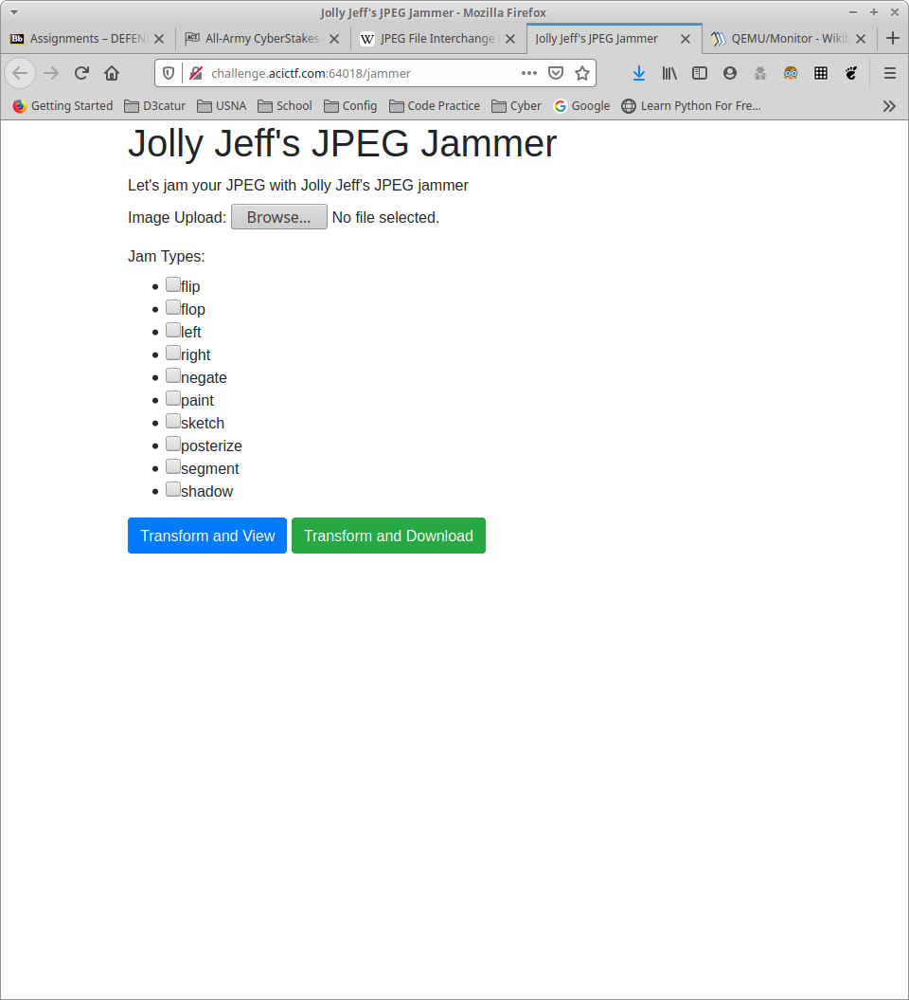
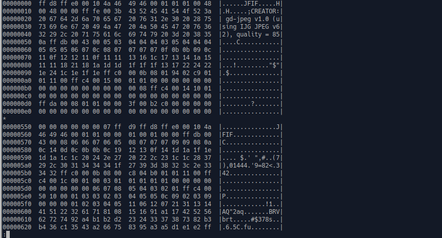

TF: Cyberstakes 2020
Challenge: That's More Than Enough

Category:  forensics

Points: 20

Difficulty: Intermediate

## Instructions

***Description:***

We think Jolly Jeff is up to no good. See if you can find the hidden message
in his [JPEG Jammer](http://challenge.acictf.com:64018/jammer).

***Hints:***

Hex editors, such as bless or wxHexEditor, are great for viewing file contents.
Install bless with "sudo apt install bless" or wxhexeditor with "sudo apt
install wxhexeditor".

Take a look at the
[JPEG file format specification](https://en.wikipedia.org/wiki/JPEG_File_Interchange_Format#File_format_structure).

## Solution

If we go to the website this is what we are presented with:

So I simply uploaded a photo to the website and got back a jammed.jpg file.
I selected all the options and got back a white picture which was dissapointing,
but following the hints I looked at the hexdump of the jammed.jpg with `hd` and
found that there was in fact an image within jammed.jpg easily identfied by
both the header FF D8 and the ascii equivalent JFIF.

So I then used hexedit to copy and paste the embedded hex into its own file,
which produced an image containing the flag:

## Flag

`ACI{26441c96ec62bf7db466df7affa}`

## Mitigation

This highlights the need to examine all of the files that we may believe to
be malicious, as any file could be hidden within that jpeg, meaning it can be
used to transfer malware or hidden messages. The best way to prevent this is to
possibly build a program that automatically checks all files to make sure that
they don't contain another file inside of it.
