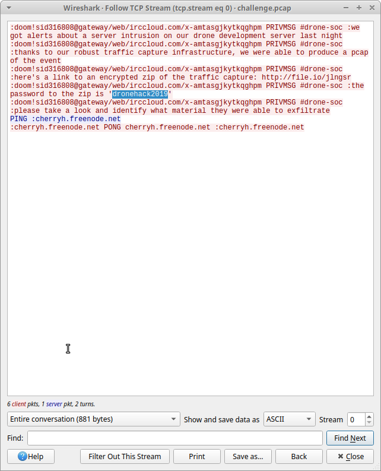
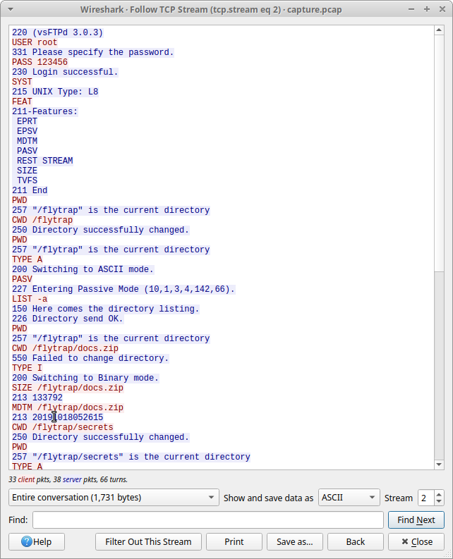
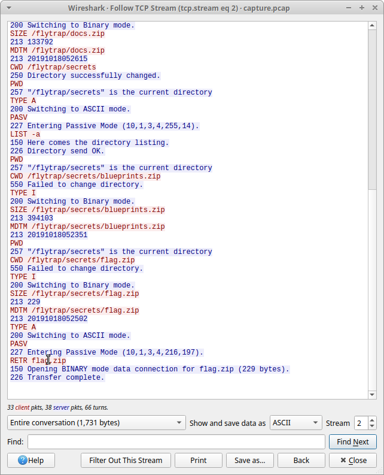
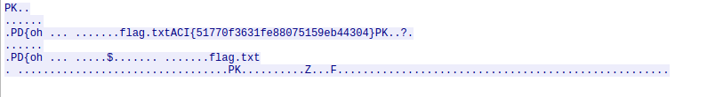

TF: Cyberstakes 2020
Challenge: Turtles All the Way Down

Category:  forensics

Points: 20

Difficulty: Intermediate

## Instructions

***Description:***

Early this morning, a breach occurred on the server hosting our next-gen drone
development repository. It is your job to figure out what was taken: [challenge.zip](challenge.zip)

***Hints:***

Our analysts are using IRC to share information and investigate this breach.

Everything you need lives within these PCAP's, you simply need to carve out 
the relevant files.

These ZIPS appear to have been generated with 7zFTP is a simple text-based
protocol, with passive binary streams for file transfers.

## Solution

First we should `unzip` the file which reveals that we will be dealing with a
pcap file.

So I opened it up in wireshark. The first thing I do is a brief scan to see
what the different protocols are, this is easily visible in the protocol
heirachy panel in the statistics menu. In this pcap we see that the most common
packets are IRC, which is the Internet Relay Chat Protocol. So naturally I followed
the TCP stream of the IRC packets and we got this:

What we get from this is that the analysts caught a mysterious file from the
website mentioned in the chat, they also give the password for the zip file.
When looking at the different protocols I noticed that there were some http
packets so, we can try to export the http objects and see if we can carve out
the zip files. Thankfully we can and we get a zip file, thanks to the hints
I know that it is actually a 7zip file and thus I need to use 7Zip to unzip it.
So we do `7z -pdronehack2019 x jlngsr`, which gave way to another pcap file.

Opening up that pcap in wireshark and again viewing the protocols we see that
ftp(file transfer protocol) is the most used, so I viewed the TCP stream which
gave this:

Now there is a couple of things to analyze here, we see that they got a succesful
login and we can even see the username and password for the ftp server. Next we see
that it moves through the file system to get to flag.zip and transfers the contents
successfully. What we can do then is move therough more of the TCP packets and open
the streams and eventually we get the solution that has the flag, it is important
that there is no filter:

## Flag

`ACI{51770f3631fe88075159eb44304}`

## Mitigation

To me the real problem here is the lack of complex passwords, the infiltrator would
have never been able to access the files if the root password was more complex. So
to avoid this breach again credentials should be more complex and more security
should be put in place.
