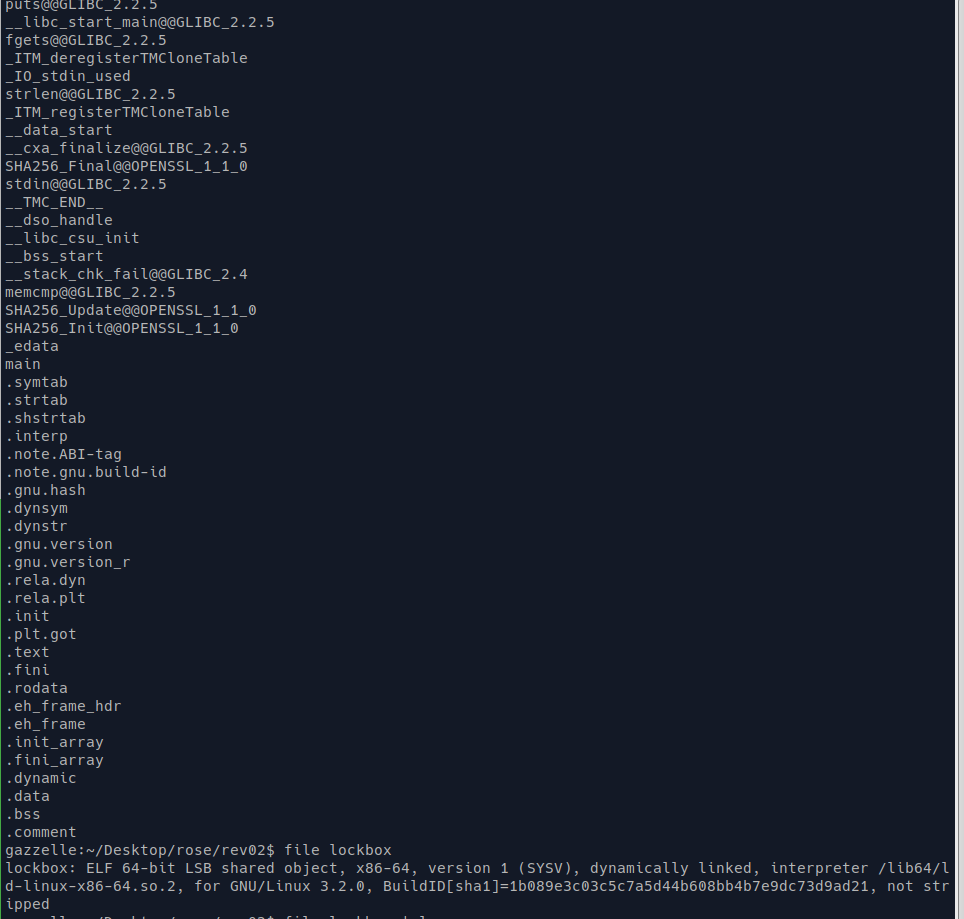

TF: Cyberstakes 2020
Challenge: Lockbox

Category:  RE

Points: 20

Difficulty: Introductory

## Instructions

***Description:***

We developed this password-protected [program](lockbox)
which uses a super-secure, military-grade hash function with 256-bits of
security to ensure only someone with the proper password can print the flag.

***Hints:***

You do not need to crack the password.

Tools like `ghidra` are helpful when `strings` isn't enough.

Looking at calls to `printf` and `puts` is probably a good place to start.

## Solution

A quck file and strings, reveals a couple of things. First we see that
it is a 64 it ELF and that symbols are not stripped from it. We also
see alot of interesting strings that could possibly be apart of the
flag.

To dive a little deeper into those strings I ran `rabin -zzq` which
can extract just strings from the binary and we see we get how format
string for a printf and the strings that most likely go into it, however,
it is evident that we are still missing some strings.

Running the program does not give us any further clues we are asked
for a passowrd and get text back telling us we are wrong.

So the next step is to do some analysis so I opened it up in r2.

What it looks like is it takes in the string and computes the SHA256 of it,
and if that is equal then it prints out the flag. Starting at address
`0x00000a37` it begins to build the flag. Knowing that everyting is placed on
the stack in reverse we can actual rebuild the flag since the symbols
and commetns are loaded in the binary.

But we see there is still the problem of converting one string into hex,
so lets see if redfine the jmp to jmp to the part where it prints out the
flag instead which is at 0xa37 to get the flag even with the wrong
password. So we have to reopen the file in write mode(I also made a copy)
and bring the line `jmp 0xa84` to the top and then hit` A` to begin typing
a new code to change it to be `jmp 0xa37` now when we run the code it prints
out the flag.

## Flag

ACI{c0de_has_mil_grade_crypto}

## Mitigation

The problem here is that the binary has no protection against allowing the
user to simply edit the assembly to jump to printing the flag out instead.
The best way to mitigate this is to have some sort of protection against this,
or obfuscate the binary to make it harder to analyze the binary.
