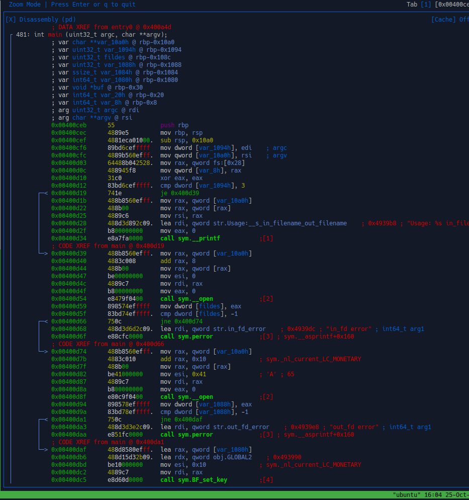
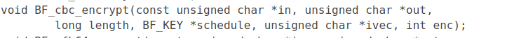
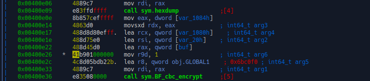
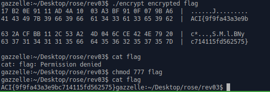

TF: Cyberstakes 2020
Challenge: National Dex#65

Category:  RE

Points: 20

Difficulty: Intermediate

## Instructions

***Description:***

We found the encryptor [encrypt](encrypt) but it won't decrypt [encrypted](encrypted)?

***Hints:***

I think they're using a cipher designed by Bruce Schneier.

When reversing, it's useful to look for magic constants or use a tool like
findcrypt (idapython version or Ghidra version).

Make sure you're using CBC mode.

## Solution

On this problem the hints were very interesting, I looked up CBC Encryption,
desinged by Bruce Schneier and got that this is most likely a Blowfish encryption.
So after reading up on it I found out how it worked. I then took a look at main in
radare2:

From what I can see it seems that the program only encrypts, however, if we take
a closer look it appears that it is using the built in blowfish libraries to do
the encryption so in the function BF_cbc_encrypt we want to edit the int enc,
so that it does decryption rather than encryption.

Specifically we must change the 1 in register 9 to a 0:

So we can go ahead and do that with r2 by entering into visual mode than editing
that line using `A`. After that we run the encrypt again and get back the
decrypted chipher text.

## Flag

`ACI{9f9fa43a3e9bc714115fd562575}`

## Mitigation

The problem here is that the program uses a built in encrptyion that I can easily
understand and thus easily modify the arguments to get it to do what I want it
to do. The best solution would be to have your program do the encryption itself
and to not include a decryption algorithm with that.
