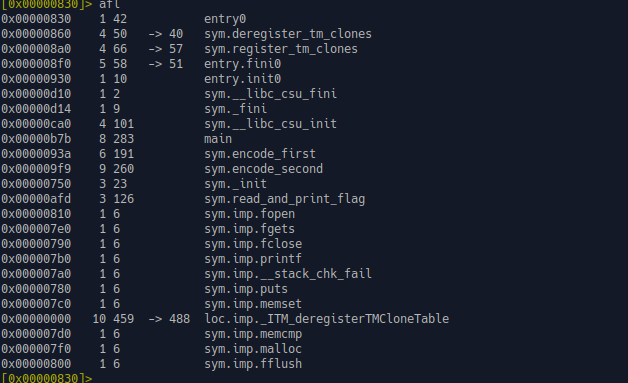
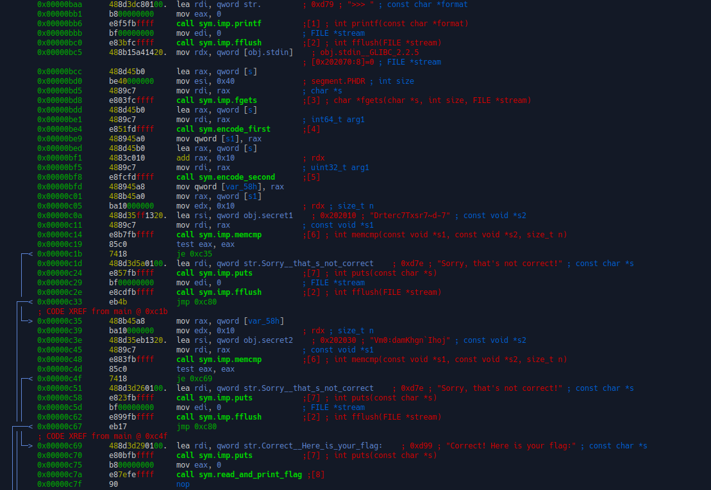

TF: Cyberstakes 2020
Challenge: Read it and Weep

Category:  RE

Points: 20

Difficulty: Intermediate

## Instructions

***Description:***

We've found a mysterious binary lying around... Can you read it's secrets?
challenge.acictf.com:40850 [read_it](read_it)

***Hints:***

There two parts to the hidden message...

A disassembler will help you make sense of the obfuscation

A XOR B = C ::: A = C XOR B

## Solution

First I opened up the bianry in r2 and ran `aaaa` to analyze the file.
A quick `afl` gives us a list of the functions:

We can se a first the main, but a more interesting function is read_and_print_flag.
So lets see how that interacts with main and possibly how we can call it.

So we can see that it takes in some input from the user, performs an encdoing on
that and then compares it to a predetermined secret string, which is
Drterc7Txsr7~d-7. If that passes then it does it again for a second secret string
Vm0:damKhgn\`Ihoj. So we need to figure out what the encoding is so we can
determine the correct strings to use. So the program splits your passphrase
into two parts and encodes those parts, it then checks each part against
the constants that they should be and if it is true it will read the flag
file and print the flag.
I am pretyy positive that those two strings combined together are the secret
message, however, when I put it into the nc it does not work.

## Flag

[ The flag here ]

## Mitigation

[ Describe the security issue that this problem highlights ]
[ What action could you take or what code could you modify to protect an organization with this vulnerability? ]

