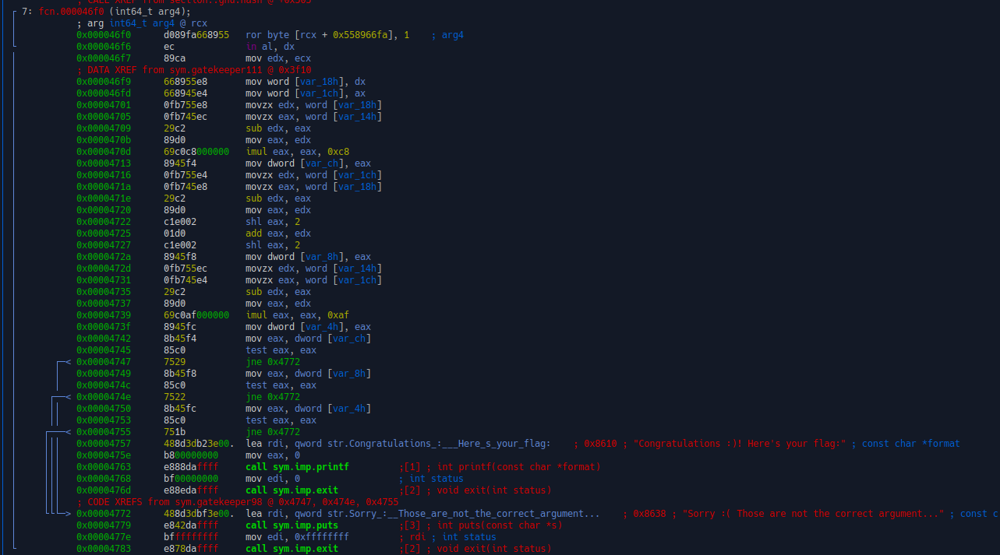

TF: Cyberstakes 2020
Challenge: Library Card

Category:  RE

Points: 20

Difficulty: Intermediate

## Instructions

***Description:***

We have recovered a library from the target. Can you reverse engineer it to
recover any hidden secret information?

***Hints:***

Are any functions different than the rest?

Try cross referencing from the print_flag function :)

If trying to link the library with your own code, double check your
LD_LIBRARY_PATH!

## Solution

If we open up the libray file in r2 and look at the functions we see one function
different from the rest which is fcn.000046f0. So lets take a look:

So instead lets edit this function to jump to the printing of the flag rather
than print we are wrong. By changing jne 0x4772 to jne 0x4757. Then we write
a quick c program to call that function and lets rename it to make it easier.
Then we just run the program

## Flag

[ The flag here ]

## Mitigation

[ Describe the security issue that this problem highlights ]
[ What action could you take or what code could you modify to protect an organization with this vulnerability? ]

