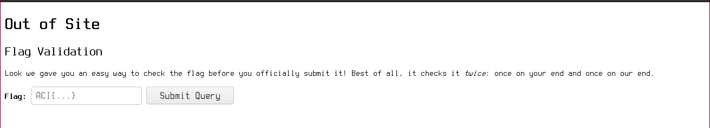
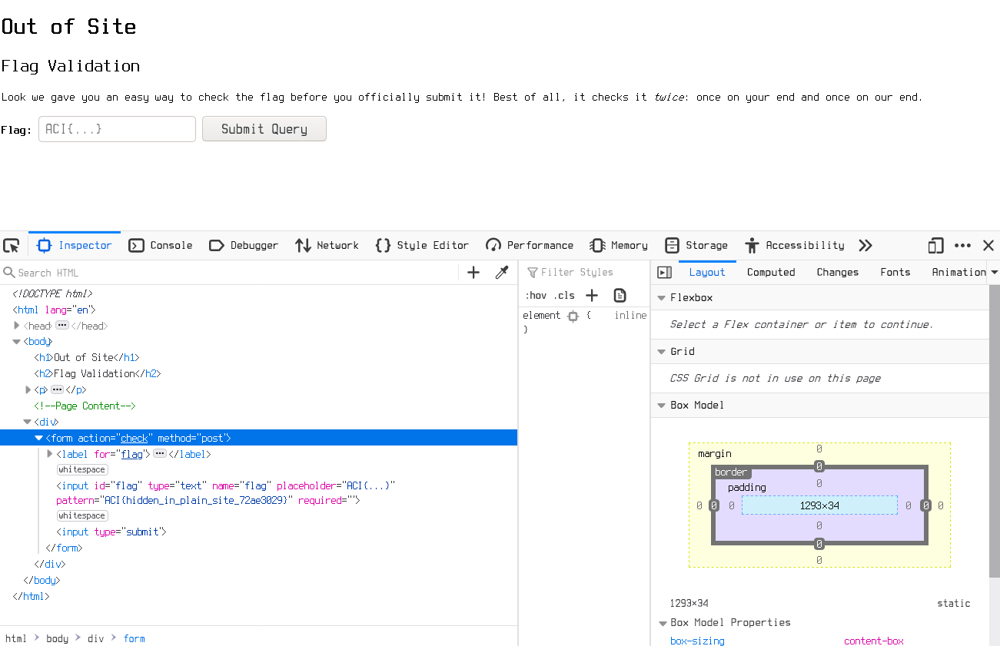

TF: Cyberstakes 2020
Challenge: Out of Site

Category: web

Points: 20

Difficulty: Introductory

## Instructions

***Challenge Objective:***

The flag submission system lets us see the strings you submitted even when
they're wrong. Since some of you may consider that a privacy issue, we decided
to demo a flag validation system that checks it client-side before sending the
flag to us for checking. Why don't you give it a try: http://challenge.acictf.com:43329

***Hints:***

How does your browser know what the right key is to do the check?
If only there were a way to `control+U`'re view of what the server sent you.

## Solution

If we go to the website we are given this base website with a form. Trying to
submit something to the form just takes us to another website saying that we
were wrong. 

However, it says the the falg validation system checks it client-side, which means
that the check must be able to be seen in the developer's tools view of the website,
as the check is being performed on our machine. So we can open up the devloper's
tools using `ctrl-shift-i` and going to the inspector if we expand the sections
we can clearly see the flag for this level hiding in the client-side html form
code that is the flag validation.

## Flag

`ACI{hidden_in_plain_site_72ae3029}`

## Mitigation

The security issue is a data/information leak. To remedy this leak, it would
be best to instead run a server side script on the form to validate the flag
entered by the user, that way no one can see it from the html client side
code.
