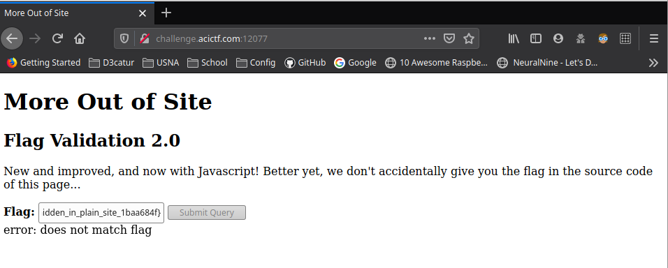
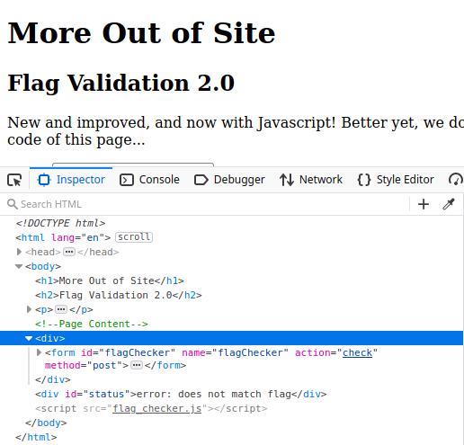
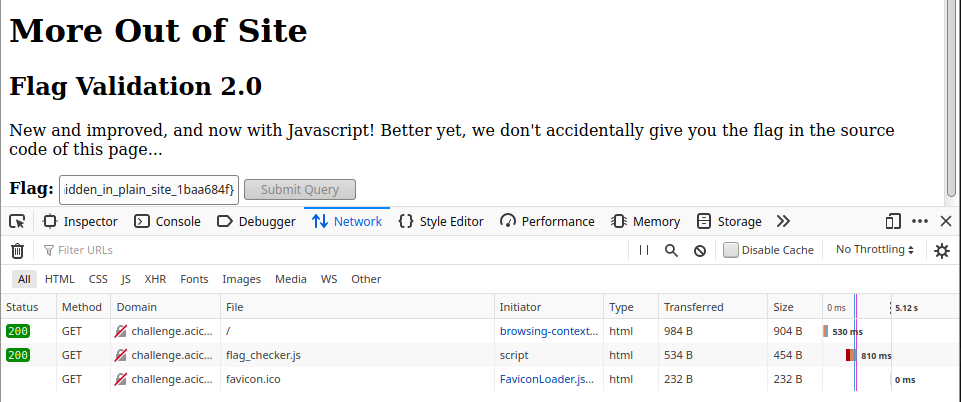
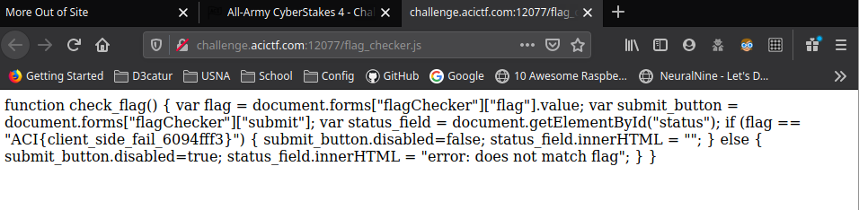

TF: Cyberstakes 2020
Challenge: More Out of Site

Category: web

Points: 20

Difficulty: Introductory

## Instructions

***Description***
Well that was embarrassing... Who knew there was more to a web site then what
the browser showed? Not to worry, we're back with a new and improved Javascript
version! http://challenge.acictf.com:12077

***Hints***
The Javascript code in an onInput gets called anytime you interact with a text field.

Is there anyway to view the Javascript definition of this function? 
It should just be text and your browser has it somewhere (it is running it after all).

## Solution

First we go to the website and we are presented with the a form to input the flag to be
checked.

The first thing I tried like the last problem is to try and give any input to the form,
and one important thing I noticed is that it told me I was wrong before I even hit the
submit button. That indicates that this is running a constant check on the form, but
does not require the submit button or remote code execution. So most likely the code
is instead validated on the client side, so I then headed to the html source.

I did not find the flag in the html instead you can see that the code is constantly running this:
    
Now I know for a fact that the flag validator is running some javascript script to do the validation
and that file is included in the files I received most likely as the source does not point to a
server to run the script. So if we head over to the network section of the developer's tools
we can see that in fact a file called flag_checker.js was transferred to our browser.

If I click on that file it will open up the source of the script and show me the contents of it. In
there I can see the flag in plain text.

## Flag

`ACI{client_side_fail_6094fff3}`

## Mitigation

The security issue hear is a data/information leak. By letting the javascript file execute on the
client side we see that it allows anyone to still see the flag as they can view the flag_checker.js
file. The optimal mitigation of this would be to isntead point the form to execute a script
that is stored on the server, to prevent the user from being able to see the contents of the script.
