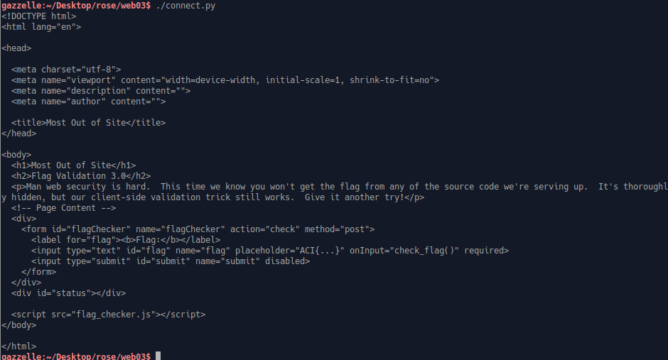
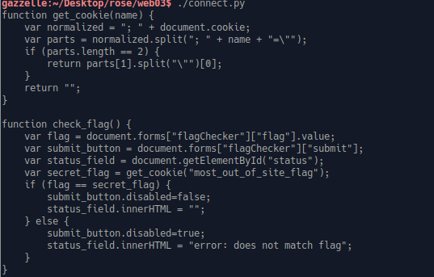
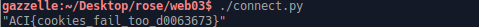

Challenge: Most out of Site

Category: web

Points: 20

Difficulty: Introductory

## Instructions

***Description***
Alright, one more try. We had to think long and hard about how to keep you from
viewing the flag. After a quick snack break, we had an epiphany. Your tricks
won't work this time. http://challenge.acictf.com:2342

***Hints***
What on earth could snack food have to do with this problem?
The browser must be storing these cookies somewhere...
If you're getting tired of using a browser, the Python Requests library is
pretty useful for interacting with web servers.

## Solution

This time I tried to do the challenge a bit different by using python to access
the website and get the flag. I did first look at the website at it was the same
base website with a flag verification form. So what I did was write a python script
called connect.py to grab the html from the website. It looks like this

    import requests
    url = 'http://challenge.acictf.com:2342/'
    r = requests.get(url)
    print(r.txt)

What that gives is this output: 

From this we can once again see that they are using a script to do the flag validation.
We can actually access this javascript file since it is run on the client side
by altering our url to `'http://challenge.acictf.com:2342/flag_checker.js'`.
Running the python script now gives us this: 

What this source code shows is that one thing important it checks if the flag is
equal to a variable called secret_flag. We see that `secret_flag` is equal to
a cookie called "most_out_of_site_flag". So we can safely assume that the
flag is most likely stored in that cookie we can get that cookie with
python by changing the url back and instead doing
    print(r.cookies['most_out_of_site_flag')]
Which gives: 

## Flag

`ACI{cookies_fail_too_d0063673}`

## Mitigation

This is a data/information leak, specifically the leak is in the javascript
source code and the cookies. There is too much information that is viewable
to the users, by allowing any client side validation that uses cookies, without
any extra encoding or obsfucation. To mitigate this you would need to provide
some other method to encode the flag or to instead do a server side validation
of the flag.
