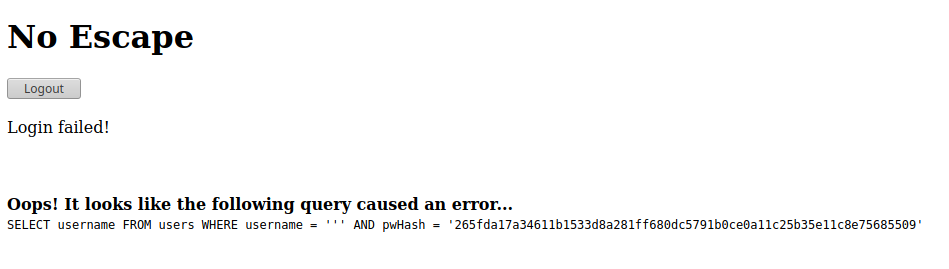

TF: Cyberstakes 2020
Challenge: No Escape

Category: web

Points: 20

Difficulty: Introductory

## Instructions

***Description:***

Since in-person events are currently banned, some magician we've never heard of
is trying to sell us on the idea of a "digital" magic show where the magician
logs in using an impossible password. For added assurances, one lucky audience
member is able to login and see the hash of the password as proof the password
is impossible. We're willing to bet the secret to this magic trick is not all
that complicated. http://challenge.acictf.com:47635

***Hints:***

Inexperienced web application developers don't always esacpe/sanitize user inputs
in there database query strings. This frequently allows SQL injection attacks that
result in unintended behavior.

The developer was pretty new, so just causing the query to error out may get you
more information for the exploit. What happens when you use a single ' or " in
each of the login fields?

You'll need to login as a specific user. If you're new to SQL syntax, this might
be useful resource for understanding the intended query and how you can
manipulate it for your purposes."

## Solution

Going to the website we are presented with a basic login page. My first steps is
always to inspect the html and cookies, but neither showed anything strange, just
the normal html form and basic cookies. I was stuck so I decided to look at the
first set of hints. What the hints show is that this is most likely a sqlinjection
and that I can use basic sql syntax to sign into the website. The first thing I tried
was the suggestion from the hints to use a "'" for the password and username to cause
an error in the query and see if I can get back an error message.

From this we see the synatx of the sql query to find the user. More importantly we
see that the query does not sanitize any of its input. What this means is we can
in fact put in any sql syntax that is logically correct and control the query
ourselves. The most common thing is to bypass the password verfication by
commenting that section out we can do that simply by providing a valid username
and followed by `'--'` the most common username is admin so I tried that first
and put in gibberish for the password. So it looked like this
username: admin '--' password: afjdlskjf. Which gave:

So from the instructions we can try the same exact thing, but this time we
should instead use "houdini" as the username. So it would be this username:
houdini '--' password: fkjasdklfjasl.  Which then gives us the flag:

## Flag

ACI{0f49e3d2757be2510a06c20b2b4}

## Mitigation

This is improper input sanitzation and database security. There are multiple
things that need to be mitigated in this case. Firstly, we were able to get
as much infomation as we could because the database programmer allowed error
messages to be printed to the website. These messages should be supressed,
so the user cannot analyze the query. Secondly, the proper sanitzation on
the input should be implemented. The user should not be able to inject their
own sql instructions into the query, and all sql comments, commands, and
words in the input should be properly sanitized.
