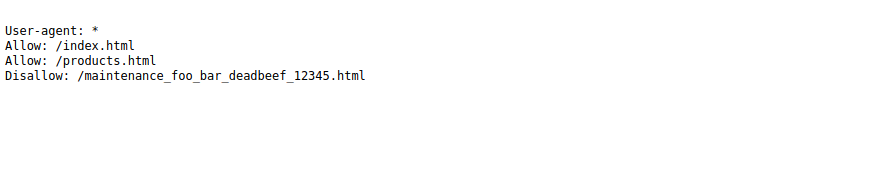
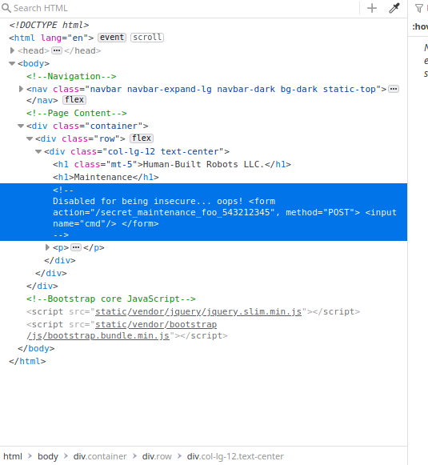
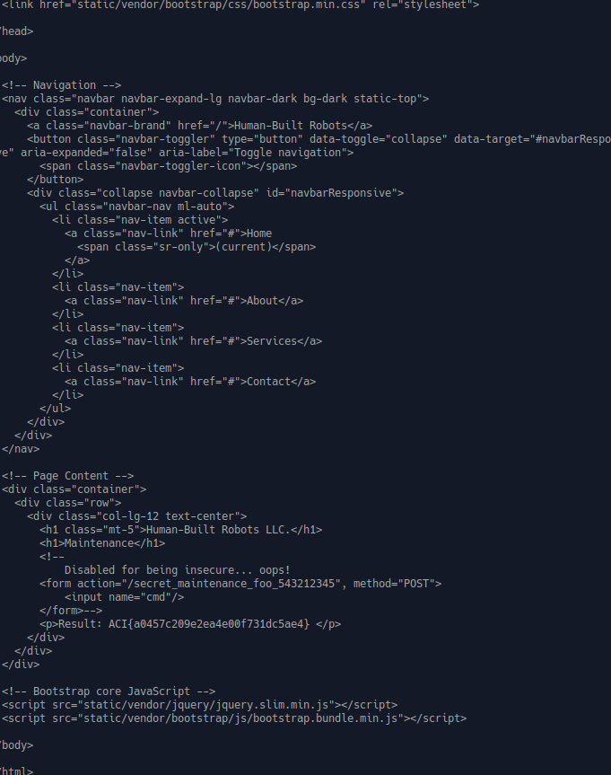

TF: Cyberstakes 2020
Challenge: DENIED

Category: web

Points: 20

Difficulty: Introductory

## Instructions

***Description:***

Sometimes websites are afraid of the terminator finding things out.
http://challenge.acictf.com:48390 The flag is in flag.txt.

***Hints:***

How can websites keep search engines from finding private information?
Sometimes the developers leave some comments that give you a hint about what to do.
You can use the cat command to read files

## Solution

First I visited the base website to see what it looked like:

From this I gathered that we should be looking for a robots.txt page on the
webpage given all the references to robots. So I added /robots.txt to the
url and was presented with this page:

So we can then visit the page that is disallowed which is
\maintenance_foo_bar_deadbeef_12345.html. When we get the page it prompts
us to run a command, but there does not seem to be any form to input a command.
So I decided to dig around in the html:

In that html I saw an extremely suspicious comment that was
"Disabled for being insecure... oops!" followed by a form that sent a POST
request to /secret_maintenance_foo543212345, with the input of cmd. So just
I assume that if I send a post request to this url with information a command
I should be able to remotely execute some code, for example opening up a file
with cat. From the description we know that the flag is stored in flag.txt, so
if we send a POST request to cat that file we should successfully get the flag.

I wrote a nice python script to do this for us using the requests library and it
looks like this:

    import requests
    data = {"cmd": "cat flag.txt"}
    url = "http://challenge.acictf.com:48390/secret_maintenance_foo_543212345"
    response = requests.post(url, data)
    print(response.text)

Upon running it I successfully got flag in the body of the html.

## Flag

`ACI{a0457c209e2ea4e00f731dc5ae4}`

## Mitigation

There is two security risks here. First is the robots.txt, if you do not want users
accessing a page then the correct permissions should be set on it or you need to
revaluate the use of that page. The second securty risk is arbitary remote code
execution. This POST request allows any user to send any valid bash commands to
the server to execute, this is a huge security risk. To mitigate the robots.txt
you should either not have them or password protect your website. To mitigate
the remote code execution, the form that allows this should no longer exist,
good security should never allow any user to remotely execute code on a server.
