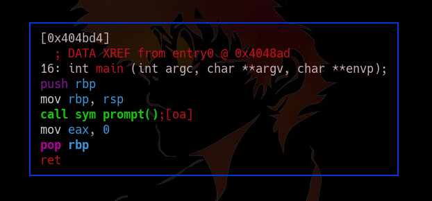
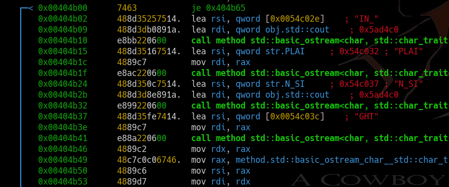

TF: Tech for Troops 2020
Challenge: BingoBox

Category:  RE

Points: 150

Difficulty: Introductory

## Instructions

***Description:***

Can you find the flag.

***Hints:****

None

## Solution

So we figure that the flag is most likely somewhere within the function, or that
we need to figure out how to get the flag to print. So I opened it up in r2 and
went straight to the main function

We can see that main calls a program sym.prompt, so we then go there and analyze
that function and we can see the flag is just there in plain text.

## Flag

`IN_PLAIN_SIGHT`

## Mitigation

The problem here is that the code is not obfuscated to hide the flag that is
probably just stored in three separate string variables. The best way to
mitigate this is to provide some form of encryption for the flag.:
