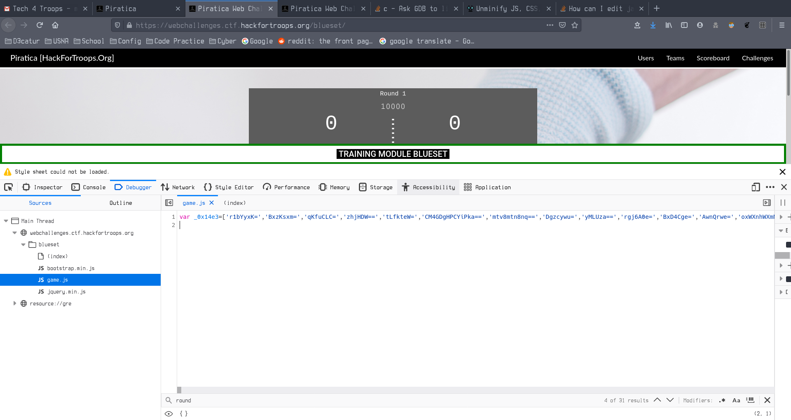
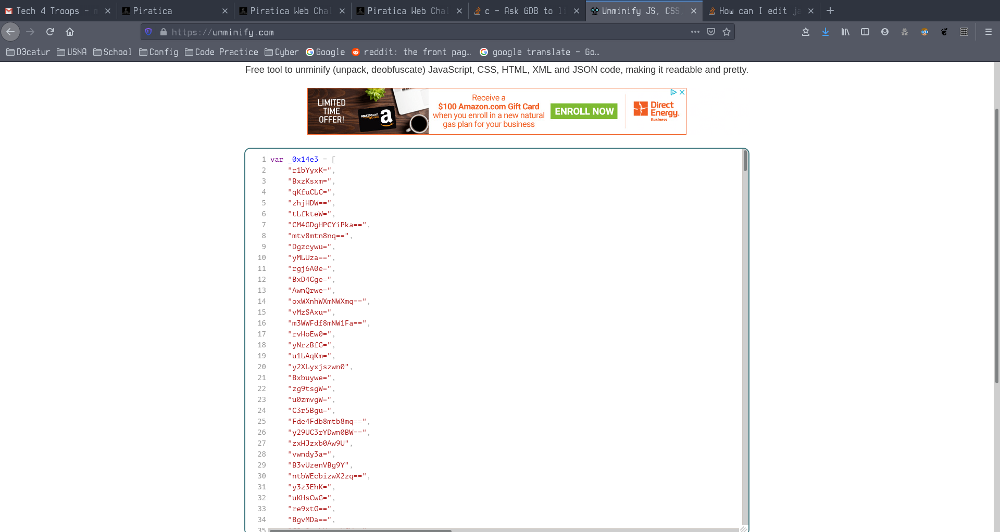
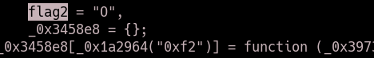
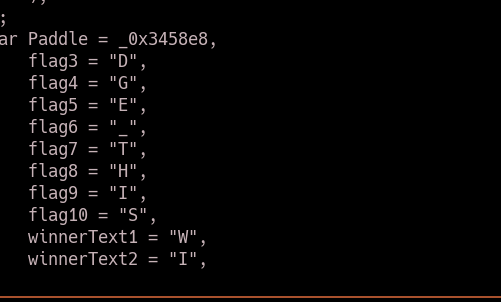

TF: Tech For Troops 2020
Challenge: Blueset

Category:  web

Points: 350

Difficulty: Intermediate

## Instructions

***Description:***

If you can make it to round 10,000 you will ge the flag.

***Hints:***

None

## Solution

If we go to the website it is a pong game that has been implmented using
JavaScript. The description tells us if we get to round 10000 then we will
get the flag. That tells me that essentially the flag must be stored
somwhere within the javascript that way it can print it on that condition.
So I went to go look at the java scrip tand this is what I found:

Obvioulsy it has been minfied so we can put it into a beautifier and then
download it for some easier analysis:

[Beautified Javascript](game.js)

So what I did was opened this in VIM and searched to find a variable possibly
called flag and thus I found all the parts of the flag within the javascript.

## Flag

`DODGE_THIS`

## Mitigation

The problem here is that the javascript does not encoding or encryption of the
flag, it is just hidden in plain sight. It is also true that it is run on the
client side, if there was a back end script to get the flag instead that would
be better.
